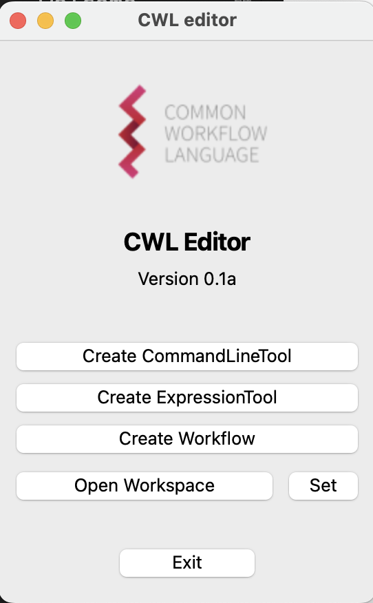
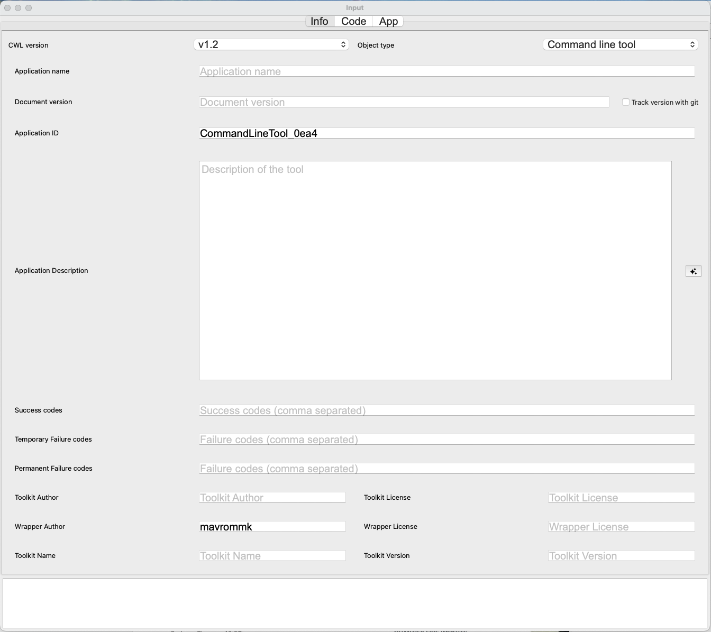
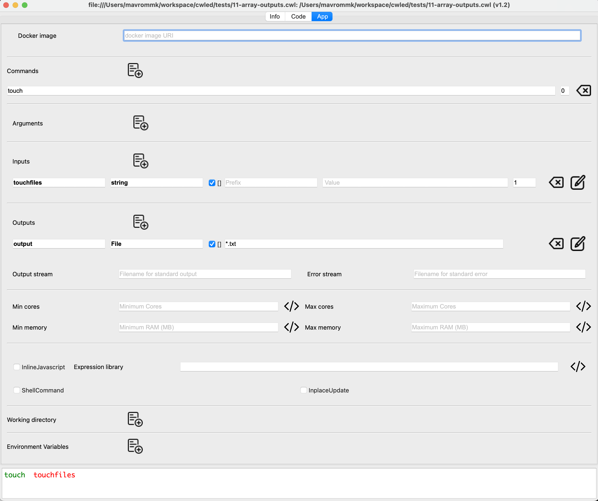
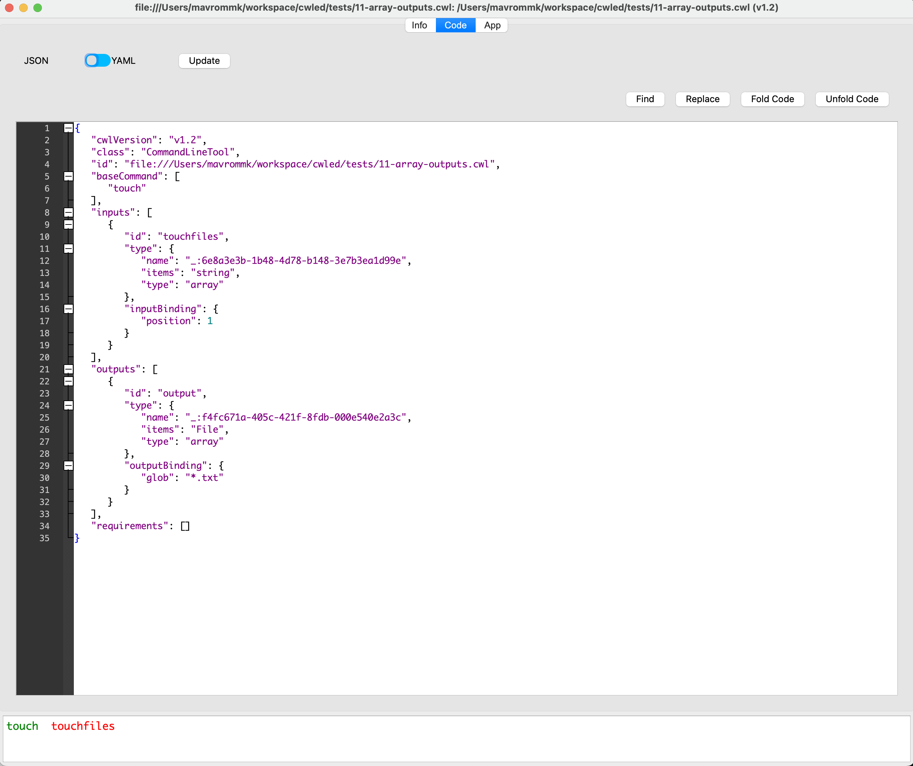
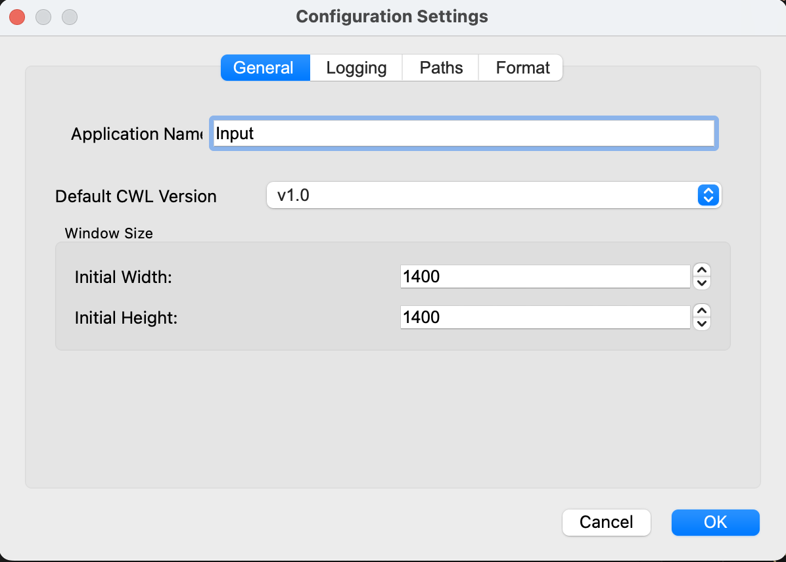

# Introduction 

**CWLed**: A Graphical Editor for Common Workflow Language (CWL) Documents
**by K.Mavrommatis**


The development of complex data analysis pipelines, particularly in bioinformatics, relies on ensuring reproducibility and portability. The Common Workflow Language (CWL) has emerged as a critical standard for describing these workflows, but its syntax can be verbose and complex. Manually authoring CWL documents is often a tedious and error-prone process, requiring developers to have an in-depth understanding of the specification's intricate details. This complexity creates a significant barrier for many researchers and creates a clear need for a specialized editor that can abstract away the boilerplate, validate the code in real-time, and provide a more intuitive interface for workflow construction.

CWLed was developed to address this need, providing a powerful and user-friendly graphical interface for creating and editing CWL tools and workflows. Its primary utility lies in simplifying the development process by allowing users to visually construct complex pipelines without needing to write CWL code by hand. By offering features like form-based editors for tool parameters, and access to cwl validation tools, it lowers the barrier to entry for creating standards-compliant, reproducible workflows. This enables scientists and developers to focus on the logic of their analysis rather than the intricacies of CWL syntax, ultimately accelerating scientific discovery.

The architecture of CWLed is designed for flexibility, catering to both visual-oriented users and those who prefer to work directly with code. Its core feature is a dual-view system that seamlessly integrates a graphical workflow editor with a raw CWL code editor. Users can build a pipeline by dragging and connecting nodes in the graph view, and the corresponding CWL code is automatically generated in the background. Conversely, any changes made directly in the code view are immediately reflected in the visual graph. This hybrid approach allows for rapid prototyping and high-level management in the GUI, while still providing developers with the fine-grained control and power of direct code editing.


# Table of Contents

- [Introduction](#introduction)
- [Table of Contents](#table-of-contents)
- [Installation](#installation)
  - [MacOS](#macos)
  - [Linux](#linux)
  - [Manual](#manual)
  - [Integration with LLMs](#integration-with-llms)
- [Usage](#usage)
- [Main Window](#main-window)
  - [Document Creation Buttons](#document-creation-buttons)
- [Command Line tool Editor](#command-line-tool-editor)
  - [Info Tab](#info-tab)
  - [App Tab](#app-tab)
    - [Command Line Tab](#command-line-tab)
  - [Code Tab](#code-tab)
- [Workflow Editor](#workflow-editor)
  - [Info Tab](#info-tab-1)
  - [Workflow Tab](#workflow-tab)
  - [Summary Tab](#summary-tab)
  - [Code Tab](#code-tab-1)
- [Dialogs](#dialogs)
  - [ArgumentDialog](#argumentdialog)
  - [InputDialog](#inputdialog)
  - [OutputDialog](#outputdialog)
  - [StepDialog](#stepdialog)
- [Configuration](#configuration)
  - [General Tab](#general-tab)
  - [Logging Tab](#logging-tab)
  - [Paths Tab](#paths-tab)
  - [Format Tab](#format-tab)
- [Menu Options](#menu-options)
  - [File Menu](#file-menu)
  - [Tools Menu](#tools-menu)
  - [Window Menu](#window-menu)
- [Test Files Reference](#test-files-reference)


# Installation

## MacOS
Use the provided .dmg file to install the application on macOS systems.
In case you get an error that MacOS cannot verify the developer of the app, go to System Preferences -> Security & Privacy and under the General tab click 'Open Anyway' for CWLed.
or run

```
xattr -d com.apple.quarantine /path/to/CWLed.app
```

The application requires some external tools to be installed, namely :
`cwltool` (v3+) (`pip install cwltool`)
`node` (v24+) (install from https://nodejs.org/)
`cwlformat` > 2022.2.18 (`pip install cwlformat`: provides cwl-explode)
`sbpack` >= 2024.12.17 (`pip install sbpack`: provides cwlpack)

These are installed when the application is installed from the command line (see below) but if you use the .dmg file you need to install them manually.


## Linux
In some Linux installations one may have to install libxcb-cursor. 
If an error like the following pops up 
```
qt.qpa.plugin: From 6.5.0, xcb-cursor0 or libxcb-cursor0 is needed to load the Qt xcb platform plugin
```
Run
`apt install libxcb-cursor-dev`

## Manual

```
conda create --name cwled python=3.10

conda activate cwled

git clone https://github.com/kmavrommatis/cwled.git cwled
cd cwled
pip install -r requirements.txt

```

## Integration with LLMs 

To enable the use of LLMs (ChatGPT, Google gemini etc.) make sure that 
entry `LLModel` in ${CONFIG_DIR}/cwled.yaml is set to the desired model (using Langchain model names)
Currently the models by OpenAI, Google and Anthropic are supported.
Add the file ${CONFIG_DIR}/cwled.env in the cwled folder with the required API keys, e.g.  

`OPENAI_API_KEY=<your_openai_api_key_here>`
Or
`GOOGLE_API_KEY=<your_google_gemini_api_key_here>`

# Usage

If you choose to run from command line, navigate to the cwled folder and run:
```
cd cwled
./cwled.py --help


usage: cwled.py [-h] [--input-file INPUT_FILE [INPUT_FILE ...]] [--new-workflow NEW_WORKFLOW] [--export-image EXPORT_IMAGE] [--new-commandline NEW_COMMANDLINE] [--new-expression NEW_EXPRESSION] [--workspace WORKSPACE] [--version] [--reset-config]

options:
  -h, --help            show this help message and exit
  --input-file INPUT_FILE [INPUT_FILE ...]
                        Path(s) to the input file(s), separate them with a space.
  --new-workflow NEW_WORKFLOW
                        Edit a new Workflow
  --export-image EXPORT_IMAGE
                        Export a plot of the workflow to an image (.svg, .jpg, .png)
  --new-commandline NEW_COMMANDLINE
                        Name of the new CommandLineTool
  --new-expression NEW_EXPRESSION
                        Name of the new ExpressionTool
  --workspace WORKSPACE
                        Default location for the CWL tools
  --version             Show the version of the tool
  --reset-config        Reset user config to defaults before startup


```


# Main Window



The main application window serves as the central hub and welcome screen for the CWL Editor. It provides quick access to the most common actions for creating new documents and managing the workspace. The window is designed to be simple and intuitive, featuring the application's logo, name, and version number, followed by a series of clearly labeled buttons.

## Document Creation Buttons
This group of buttons allows you to immediately start creating a new CWL document. Clicking any of these will open a new, dedicated editor window tailored to the specific document type.

*Create CommandLineTool*: This is the most common action. It opens a new editor window for defining a CommandLineTool, which is a wrapper around a command-line program (e.g., samtools, bwa). The editor includes fields for specifying the base command, arguments, inputs, and outputs.

*Create ExpressionTool*: This opens an editor for creating an ExpressionTool. This type of tool is not based on an external program but instead performs its logic using a JavaScript expression. It's useful for simple data manipulation tasks within a workflow.

*Create Workflow*: This opens the powerful graphical workflow editor. It provides a canvas where you can build a complex pipeline by dragging and dropping existing tools (both CommandLineTool and ExpressionTool) and connecting their inputs and outputs to define the flow of data.
Workspace and Application Control
These buttons manage the overall environment and the application itself.

*Open Workspace*: This button opens a new window that acts as a file browser for your designated workspace directory. It allows you to see all the files in your project, and you can select any CWL file from the list to open it directly in a new editor window.

*Set*: This opens a system dialog that allows you to select a folder on your computer to be the new workspace directory. All subsequent file operations, like opening and saving, will default to this new location. Alternatively this directory can be set in the application configuration.

*Exit*: This button closes the main window and all open editor windows, terminating the application.

# Command Line tool Editor

The window for editing a CommandLineTool is a powerful and versatile interface designed to streamline the process of wrapping a command-line program in CWL. It is organized into three distinct tabs: Info, App, and Code, each providing a different view and level of control over the tool's definition. This multi-faceted approach allows users to switch between high-level metadata editing, detailed application logic configuration, and direct manipulation of the raw source code.

## Info Tab


The Info tab serves as the central location for managing the tool's metadata and documentation. This section is crucial for making the tool understandable, searchable, and easy to use for others. It provides dedicated fields for editing the core descriptive properties of the CWL document.

*ID*: A unique identifier for the tool within the workflow.
*Label*: A short, human-readable name for the tool that is often displayed in graphical interfaces.
*Documentation*: A rich text field for providing a detailed description of what the tool does, its purpose, and any important usage notes.
*CWL Version*: A dropdown menu to select the version of the CWL specification that the tool adheres to (e.g., v1.0, v1.1, v1.2).
*Additional Metadata*: Options to manage extension fields for adding custom metadata annotations that may be required for specific use cases or integrations such as authorship, licensing, or versioning.
*Track Version with Git*: To help you manage the evolution of your CWL documents, the editor includes a powerful "Track Version with Git" feature. When this functionality is enabled, every time you save a CommandLineTool or Workflow, the application automatically performs a git commit and creates a git tag for that specific version of the file. This creates a detailed and robust version history of your document directly within your project's Git repository, allowing you to easily inspect, compare, or revert to any previously saved state. This feature is enabled by default but can be managed in the Info tab. When active, it works as follows:
*On Save*: When you save a file, the application automatically stages the file in Git.
*Commit Creation*: It creates a new commit with a message like "Autosave version for [your_file_name]".
*Tag Generation*: It then generates a unique version tag and applies it to the new commit. The tag is formatted using the tool's ID and the current timestamp, for example: my-cool-tool/20251117-143005.
The primary benefit of this system is that it provides effortless and granular version control without requiring you to manually run git commands. You can easily retrieve a specific version of your tool by checking out the corresponding tag in your repository (e.g., git checkout my-cool-tool/20251117-143005). This is invaluable for ensuring reproducibility, as it allows you to run a workflow with the exact version of a tool that was used previously. It also provides a safety net, giving you the confidence to experiment with your documents knowing you can revert to any saved point in time.


## App Tab



The App tab is the heart of the CommandLineTool editor, providing a structured, form-based interface for defining the tool's execution logic. This tab abstracts away the complexity of CWL syntax, allowing you to define how the command is built and what inputs and outputs are expected.

*Base Command*: A field to specify the main executable of the tool (e.g., bwa, samtools, echo).
*Arguments*: A list where you can define fixed command-line arguments or dynamic ones based on JavaScript expressions.
*Inputs*: A detailed table for defining each input parameter of the tool. For each input, you can specify its ID, data type (e.g., File, string, integer), whether it's required, and how it should be formatted on the command line (e.g., with a prefix like -i).
*Outputs*: A similar table for defining the outputs produced by the tool. You can specify the output's ID, data type, and how it is generated (e.g., by capturing stdout or by providing a glob pattern to find output files).
*Requirements*: A section to declare any special environmental needs for the tool, such as DockerRequirement to specify a container image, or ResourceRequirement to define CPU and memory needs.

### Command Line Tab

The Command Line tab displays a preview of how the command will be constructed when the tool is executed. This provides immediate visual feedback about how your base command, arguments, and inputs will be assembled into the final command line.

The preview includes:
- **Base Command**: The main executable
- **Arguments and Inputs**: Displayed in their proper positions with prefixes, separators, and values
- **Boolean Flags**: Boolean inputs without `valueFrom` expressions show only their prefix (flag)
- **Default Values**: Inputs with default values show them in the format `<inputname=defaultvalue>`
- **Array Inputs with itemSeparator**: Shown with the separator pattern (e.g., `<input,input...>`)
- **Value Expressions**: JavaScript expressions from `valueFrom` are displayed with simplified placeholders
- **Optional Parameters**: Displayed in a lighter color to distinguish them from required parameters

This preview helps you verify that your tool definition will generate the correct command line before running it, making it easier to catch configuration errors early.

## Code Tab



The Code tab provides a direct, unfiltered view of the raw CWL document. It is a fully-featured text editor with syntax highlighting for both YAML and JSON, which are the two formats for serializing CWL.

This tab is indispensable for power users who want to make precise changes, use advanced CWL features not exposed in the GUI, or simply inspect the generated code. Any changes made in the Info or App tabs are instantly reflected in the Code tab, and conversely, any valid edits made in the Code tab will immediately update the other two tabs. This seamless, two-way synchronization ensures that the visual editors and the underlying code are always in perfect harmony, offering the best of both worlds: the simplicity of a GUI and the power of a code editor.


# Workflow Editor

The window for editing a CWL Workflow is a powerful, visually-oriented interface designed for composing multi-step analysis pipelines. It allows you to define complex data dependencies and orchestrate multiple tools without needing to write CWL code manually. The editor is organized into several tabs that provide different ways to view and interact with the workflow: Info, Workflow, Summary, and Code.
(Note: The Workflow editor does not have an 'App' tab, as that tab is specific to defining the execution of a single CommandLineTool or ExpressionTool. The 'Workflow' tab serves the equivalent purpose for a workflow.)

## Info Tab
The Info tab is identical in function to the one in the CommandLineTool editor. It is the central place for managing the workflow's metadata and documentation, which is essential for making your pipeline understandable and reusable.

*ID*: A unique identifier for the workflow.
*Label*: A short, human-readable name for the pipeline.
*Documentation*: A detailed description of the workflow's purpose, the analysis it performs, and any important information about its inputs and outputs.
AI-Powered Documentation Generation
Next to the Documentation text box in the Info tab, you will find a button with a sparkle icon (✨). This is the AI-powered documentation generation feature, designed to help you quickly create high-quality, comprehensive descriptions for your tools and workflows.
When you click this button, the application sends the current state of your CWL document—including its inputs, outputs, and base command—to a Large Language Model (LLM). The AI analyzes this information and automatically generates a detailed documentation string that describes:
The overall purpose of the tool.
A list of the inputs it expects.
A list of the outputs it will produce.
This generated text is then inserted into the documentation box. This feature is incredibly useful for saving time and ensuring your tools are well-documented. Instead of manually writing out every detail, you can generate a robust starting point in a single click and then refine it as needed. It helps maintain consistency and quality in your documentation with minimal effort.

*CWL Version*: A dropdown to select the CWL specification version.
*Namespaces*: Advanced options for defining and managing namespaces for metadata annotation.

## Workflow Tab
This is the main graphical editor and the most important feature of the workflow window. It provides an interactive canvas where you can visually construct your pipeline.

*Graph View*: A canvas where each step in the workflow is represented as a node. You can drag tools from a library or your workspace onto the canvas to add them as steps.
*Nodes and Ports*: Each node has input and output ports corresponding to the parameters of the underlying tool. You can define the flow of data by clicking and dragging connections between the output port of one node and the input port of another.
*Workflow Inputs/Outputs*: You can define the overall inputs and outputs of the entire workflow. This is typically done by "promoting" an input or output from a specific step, making it part of the workflow's public interface.
*Step Configuration*: Double-clicking a node opens a dialog where you can configure the specifics of that step, such as setting default values for inputs that are not connected to other nodes.

## Summary Tab
The Summary tab provides a high-level, tabular overview of the workflow's public interface. It is a read-only view designed to give you a quick understanding of what data the workflow requires and what results it will produce, without needing to inspect the internal graph.

*Inputs Table*: Lists all the top-level inputs for the workflow, including their ID, label, data type, whether they are required, and a description.
*Outputs Table*: Similarly, this table lists all the final outputs produced by the workflow, along with their type and description.
This tab is particularly useful for quickly verifying the "signature" of your workflow and ensuring all necessary parameters are exposed correctly.

## Code Tab
The Code tab provides a direct, real-time view of the raw CWL source code that is being generated as you build your pipeline in the graphical editor.

*Syntax Highlighting*: The editor supports both YAML and JSON, providing clear syntax highlighting to improve readability.
*Two-Way Synchronization*: This is a key feature. Any action you take in the Workflow tab—such as adding a step or connecting nodes—is instantly translated into CWL code that appears here. Conversely, if you are a power user and make a valid change directly in the code, the graphical view in the Workflow tab will update to reflect that change. This provides the ultimate flexibility, combining the ease of a GUI with the full power of direct code editing.


# Dialogs

The ArgumentDialog, InputDialog, and OutputDialog are essential components for configuring the details of a tool's arguments, inputs, and outputs. While they provide a consistent user experience, their behavior and the options they present differ significantly depending on whether you are editing a standalone CommandLineTool or a step within a Workflow.

## ArgumentDialog
The ArgumentDialog is used to define the static or dynamic arguments that are passed to a CommandLineTool.

For a CommandLineTool: This dialog is straightforward. It allows you to define a command-line argument that will be included when the tool is executed. You can specify the argument's position on the command line and its value. The value can be a fixed string or a JavaScript expression that is evaluated at runtime. This is used for arguments that are always the same every time the tool runs.

For a Workflow: This dialog is not used. Workflows do not have "arguments" in the same way CommandLineTools do. A workflow's behavior is defined by the tools it contains and the data flowing between them, not by a list of command-line arguments.

## InputDialog
The InputDialog is used to define the input parameters for a tool or a workflow. This is where the most significant differences in behavior appear.

For a CommandLineTool: When editing a CommandLineTool, this dialog allows you to define a new input parameter from scratch. You configure every detail of the input, including:

ID, Label, and Description: The metadata for the input.
Type: The data type (e.g., File, string, boolean, array).
Input Binding: This is a crucial section for CommandLineTools. It defines how the input value is translated into a command-line argument when the tool is run (e.g., by adding a prefix like -i or --input-file).
Include in command line: This checkbox is enabled only when the input has a meaningful inputBinding (for example a non-empty prefix/valueFrom/itemSeparator, a defined position, or enabled separate/shellQuote behavior).
Value from: The Value from field is available regardless of input type, including boolean inputs.
Default Value: A value to use if none is provided when the tool is run.
For a Workflow Step: When used within the workflow editor, the InputDialog's role changes from creation to connection. Instead of defining a new input from scratch, its primary purpose is to link the input of a workflow step to an output from another step or to a main workflow input.

Source Dropdown: The dialog is dominated by a "Source" dropdown menu. This menu is populated with all available data sources within the workflow: the outputs of all previous steps and the main inputs of the workflow itself.
No Input Binding: The "Input Binding" section is absent, as the command-line formatting is the responsibility of the underlying CommandLineTool at that step, not the workflow.
Default Value: You can still set a default value, which will be used if the input is not connected to any source.

## OutputDialog
The OutputDialog is used to define the outputs that a tool or workflow produces.

For a CommandLineTool: When editing a CommandLineTool, this dialog is used to specify how to capture the results of the tool's execution. You define:

ID, Label, and Description: The metadata for the output.
Type: The data type of the output.
Output Binding: This is the key section. You specify how to find the output file(s) after the tool has run, typically by providing a glob pattern (e.g., *.bam) that matches the output files. You can also specify that the output should be captured from the tool's standard output (stdout).
For a Workflow Step: Similar to the InputDialog, the OutputDialog's function within a workflow is about connecting data sources. Its primary role is to define the final outputs of the entire workflow.

Source Dropdown: The dialog features a "Source" dropdown menu that lists the outputs of every step within the workflow. You select one of these as the source for the final workflow output.

**pickValue**: (WorkflowOutputParameter only) This dropdown allows you to control how values are selected when the output source produces multiple values (e.g., from a scattered step). Options include:
- `first_non_null`: Select the first non-null value
- `the_only_non_null`: Require exactly one non-null value, fail otherwise
- `all_non_null`: Include all non-null values as an array

**linkMerge**: (WorkflowOutputParameter only) This dropdown controls how outputs from multiple sources are merged when a workflow output is connected to multiple step outputs. Options include:
- `merge_nested`: Keep values in nested arrays (preserves structure from each source)
- `merge_flattened`: Flatten all values into a single-level array

No Output Binding: The glob pattern and other binding options are not present, because the workflow is simply passing through an output that was already generated by a tool inside it. The responsibility for generating the file and giving it a name lies with the individual tool step, not the workflow's output definition.

## StepDialog
The StepDialog is a crucial configuration window used within the graphical workflow editor. When you add a tool or a sub-workflow as a step in your main pipeline, you double-click on that step's node to open the StepDialog. Its purpose is to allow you to configure all the properties of that specific WorkflowStep, controlling how it behaves and how it integrates with the rest of the workflow.
ß
The dialog provides a comprehensive set of options for managing the step, including:

ID and Label: You can set a unique identifier (id) for the step, which is used to reference it elsewhere in the workflow (e.g., in the source field of other steps). You can also provide a human-readable label for better readability in the graph.

Run: This field specifies which tool or sub-workflow this step will execute. It can be a path to a local CWL file or an identifier for a tool defined elsewhere.

Step Inputs (in): This section lists all the inputs that the underlying tool requires. For each input, you can specify its source, which is the core of workflow construction. You can link it to an output of a previous step or to one of the main workflow inputs. You can also provide a default value to be used if no source is connected.

**Conditional Inputs**: For inputs used in `when` expressions that don't correspond to actual tool inputs, you can add them in the "Conditional Inputs" section. Click the "Add" button to create a new conditional input with an ID and Source. These inputs are available in the workflow for conditional execution logic but are not passed to the underlying tool. Each conditional input can be removed individually using the "Remove" button next to it.

Step Outputs (out): This lists all the outputs that will be produced by this step. These outputs become available as potential sources for subsequent steps in the workflow.

Conditional Execution (when): This powerful feature allows you to provide a JavaScript expression that determines whether the step should be executed. The expression is evaluated at runtime, and if it returns false, the step is skipped. This is useful for creating dynamic pipelines where certain tasks are only performed if a specific condition is met.

Scattering: This section allows you to configure parallel execution. If you provide an input that is an array, you can "scatter" the step, which causes the tool to be run independently for each item in the array. You can also specify a scatterMethod to control how the outputs from these parallel runs are gathered back together.

Requirements: You can specify any special requirements that are needed just for this step, such as a ResourceRequirement to request a specific amount of CPU or memory, or an EnvVarRequirement to set environment variables.

In essence, the StepDialog is the control panel for a single component in your pipeline, giving you fine-grained control over its execution, data flow, and relationship with the rest of the workflow.


# Configuration

The configuration of the program is stored in two configuration files located in the standard configuration directories based on your operating system:
For MacOS: ~/Library/Application Support/cwled
For Linux: ~/.config/cwled/
There are two files:
`cwled.yaml` : The main configuration file storing application settings.
`cwl_env` : A file for storing environment variables, such as API keys for LLM integration.


The Configuration dialog  allows you to customize various aspects of the application to suit your preferences and environment. It is accessible via the standard **Preferences** menu item. The settings are organized into several tabs:

## General Tab
This tab contains basic application settings.
*   **Application Name**: The name of the application as displayed in the title bar.
*   **Default CWL Version**: Select the default CWL version to be used when creating new tools or workflows.
*   **Window Size**: Set the initial width and height of the main application window.

## Logging Tab
This tab allows you to control the verbosity of the application's logs. You can set the logging level (DEBUG, INFO, WARNING, ERROR, CRITICAL) for different components of the application. This is useful for troubleshooting issues or reducing log noise.
After any of these settings are changed, you must restart the application for the changes to take effect.

## Paths Tab
This tab is used to configure important file paths and directories.
*   **Workspace**: The default directory where your CWL projects and files are stored. You can browse to select a new location.
*   **CWL Runner**: Configure the commands used to run and validate CWL documents. This includes specifying the executable paths for tools like \`cwltool\` or other runners.
*   **PATH** : You can add additional directories to the system PATH used by the application. This is useful if your CWL tools rely on external executables that are not in the default PATH. e.g. if you have installed nodejs in a custom location, such as a conda environment, you can add that location here so that cwltool can find it when running CWL documents that require node.

## Format Tab
This tab provides options for formatting identifiers.
*   **Sanitize ID Format**: Choose the naming convention used when automatically generating or sanitizing IDs (e.g., for inputs, outputs, or steps). Options include:

- \`camelCase\`, 
- \`UpperCamelCase\`, 
- \`lowerCamelCase\`, 
- \`dash\` (kebab-case),
- \`keeAlphaNum\` (keep alphanumeric only),
- \`underscore\` (snake_case).


- **Open Workspace**: Opens a workspace browser window that displays all CWL files in your configured workspace directory. You can browse and select files to open in new editor windows. The workspace window stays open and can be used to quickly access multiple files.

- **Set**: Opens a directory selection dialog to set or change the workspace directory. This is equivalent to using the `--workspace` command line argument. The workspace directory serves as the default location for opening and saving CWL files.

- **Exit**: Closes all open windows and exits the application.

# Menu Options

The application provides three main menus: **File**, **Tools**, and **Window**.

## File Menu

- **Open file...**: Opens a file dialog to select and open a CWL file (supports `.cwl`, `.yaml`, `.json`, `.txt` formats). Opens the selected file in the currently active window or creates a new window if none is active.

- **Save**: Saves the current document to its existing file path. If the document hasn't been saved before, this will open the "Save As" dialog.

- **Save as...**: Opens a file dialog to save the current document with a new name or location. You can choose between JSON or YAML formats with the `.cwl` or format-specific extensions.

- **Reload file**: Reloads the current document from disk, discarding any unsaved changes. A confirmation dialog will ask you to confirm before proceeding. This is useful when the file has been modified externally (e.g., by another editor or version control system) and you want to refresh the view with the latest content from disk.

- **New** (submenu):
  - **Command line tool**: Creates a new window for editing a CommandLineTool
  - **Expression tool**: Creates a new window for editing an ExpressionTool  
  - **Workflow**: Creates a new window for editing a Workflow

## Tools Menu

- **Validate tool**: Validates the current CWL document using `cwltool --validate` (or another validator specified in your configuration). Reports any syntax errors or schema violations.

- **Generate template**: Uses `cwltool --make-template` to generate a template input file for the current tool or workflow. This creates a YAML file with all required and optional inputs pre-populated with placeholder values.

- **Pack workflow**: Packages a workflow and all its dependencies into a single, self-contained CWL document. This is useful for sharing workflows or ensuring reproducibility.

- **Restructure workflow**: Reorganizes the workflow structure, potentially simplifying the workflow graph or applying best practices for workflow organization.

- **Upgrade CWL version**: Upgrades the current document to the latest CWL specification version using `cwl-upgrader`. This helps modernize older CWL documents to use newer features.

- **Reset configuration**: Resets all application settings to their default values.. This will take effect after restarting the application.

- **Draft CommandLineTool**: Opens a dialog where you can paste help text or documentation from a command-line tool. The application uses an LLM (Large Language Model) to automatically generate a CWL CommandLineTool definition based on the provided text. The generated file is saved with a `_draft_` prefix and can be opened in a new window for further editing.

- **Troubleshoot tool/workflow**: Opens an LLM-assisted troubleshooting flow for the currently active CWL document. You provide an issue description, and the application returns guidance in a dedicated response dialog.


## Window Menu

The Window menu dynamically lists all open editor windows. Each window is labeled with:
- A window number (1, 2, 3, etc.)
- The file name (if saved) or `<CWL Type>` (if unsaved)

Clicking on a window menu item brings that window to the front and activates it. This is useful when you have multiple CWL documents open and need to switch between them.

Special entries may include:
- **Workspace**: If the workspace browser is open, this entry allows you to quickly return to it


# Test Files Reference

The files in the `tests/` directory are practical CWL fixtures you can use to test both application behavior and CWL functionality. They cover core features such as command-line bindings, expressions, complex data types, outputs, and workflows. They are largely come from the [CWL userguide](https://www.commonwl.org/user_guide)

- **01-hello-world.cwl**: Minimal CommandLineTool using a default string input bound to `echo`.
- **02-echo-network.cwl**: `stdout` capture to file, output extraction with `outputEval`, and `NetworkAccess` requirement.
- **03-echo-expressions.cwl**: Inline JavaScript with multiple dynamic `valueFrom` argument expressions.
- **04-hello-world-expressionlib-inline.cwl**: Uses `expressionLib` to define and call a reusable JavaScript helper.
- **05-input.cwl**: Mixed input types (boolean, string, int, optional File) with varied `inputBinding` patterns.
- **06-array-inputs.cwl**: Array-input binding styles, including repeated prefixed items and `itemSeparator` joining.
- **07-record.cwl**: Record-typed grouped inputs and an exclusive union of alternative record shapes.
- **08-exclusive-parameter-input.cwl**: Nullable enum choices and returning the selected value via `outputEval`.
- **09-arguments.cwl**: Fixed and runtime-derived arguments, plus file output globbing.
- **09-arguments2.cwl**: JSON-form CWL showing explicit argument fields (`position`, `prefix`, `separate`, `shellQuote`).
- **10-outputs.cwl**: Extracts a specific file from tar with a fixed File output glob.
- **101-expression.cwl**: ExpressionTool that transforms input text to uppercase with JavaScript.
- **11-array-outputs.cwl**: Produces multiple files and collects them as an array File output.
- **11-records.input**: Example input object data for record and exclusive-union parameter tests.
- **12-stdout.cwl**: Dynamic output glob based on a string input to capture a selected extracted file.
- **12-tar-param-inputs.yaml**: Concrete YAML inputs for tar extraction, including CWL File object syntax.
- **12-tar-param.cwl**: Tar extraction with File and positional string inputs, plus dynamic output file selection.
- **50-workflow.cwl**: Two-step workflow chaining external tools and passing step outputs downstream.
- **51-workflow.cwl**: Similar two-step workflow with fully inlined CommandLineTool and ExpressionTool definitions.


Attributions
<a href="https://www.flaticon.com/free-icons/save" title="save icons">Save icons created by Yogi Aprelliyanto - Flaticon</a>
<a href="https://www.flaticon.com/free-icons/commit-git" title="commit git icons">Commit git icons created by edt.im - Flaticon</a>
<a href="https://www.flaticon.com/free-icons/commit-git" title="commit git icons">Commit git icons created by HideMaru - Flaticon</a>
<a href="https://www.flaticon.com/free-icons/save" title="save icons">Save icons created by Bharat Icons - Flaticon</a>
<a href="https://www.flaticon.com/free-icons/packaging" title="packaging icons">Packaging icons created by Hilmy Abiyyu A. - Flaticon</a>